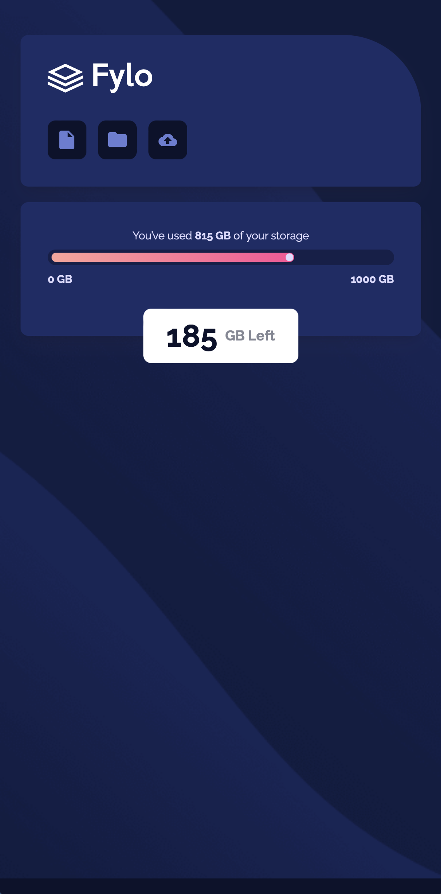
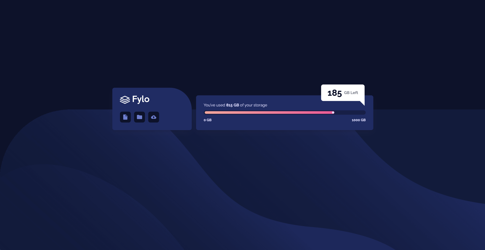

# Frontend Mentor - Fylo data storage component solution

This is a solution to the [Fylo data storage component challenge on Frontend Mentor](https://www.frontendmentor.io/challenges/fylo-data-storage-component-1dZPRbV5n). Frontend Mentor challenges help you improve your coding skills by building realistic projects. 

## Table of contents

- [Overview](#overview)
  - [The challenge](#the-challenge)
  - [Screenshot](#screenshot)
  - [Links](#links)
- [My process](#my-process)
  - [Built with](#built-with)
  - [How to build the Proyect](#how-to-build-the-proyect)
  - [Useful resources](#useful-resources)
- [Author](#author)

## Overview

### The challenge

Users should be able to:

- View the optimal layout for the site depending on their device's screen size

### Screenshot




### Links

- Live Site URL: [Fylo Data Storage Component](https://fylostorage.netlify.app/)

## My process

### Built with

- Semantic HTML5 markup
- CSS custom properties
- Flexbox
- CSS Grid
- Mobile-first workflow
- [React](https://reactjs.org/) - JS library

### How to build the Proyect

On your terminal write this command:

1. First make a cd to your Desktop.

```html
<p>Some HTML code I'm proud of</p>
```

### Useful resources

- [How to create a triangle](https://cybmeta.com/formas-basicas-con-css-triangulos-circulos-trapecios-rectangulos-cuadrados) - This page helped me to learn, how to create a triangle with pure CSS code.

## Author


- Frontend Mentor - [@JorgeDev7](https://www.frontendmentor.io/profile/JorgeDev7)
- GitHub - [@JorgeDev7](https://github.com/JorgeDev7)